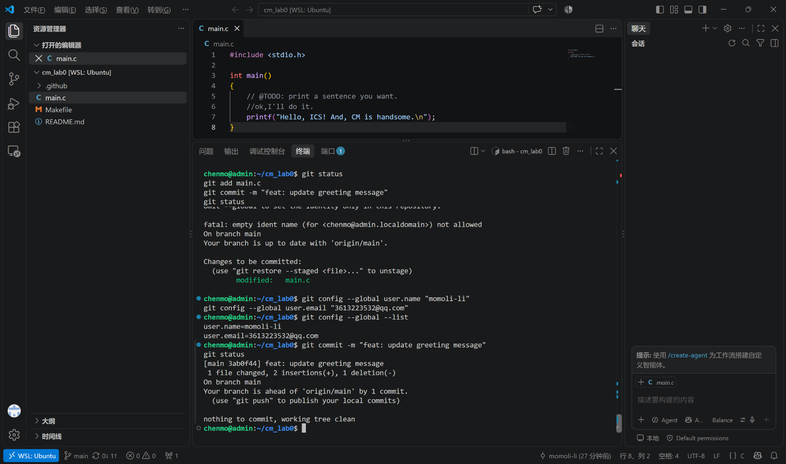
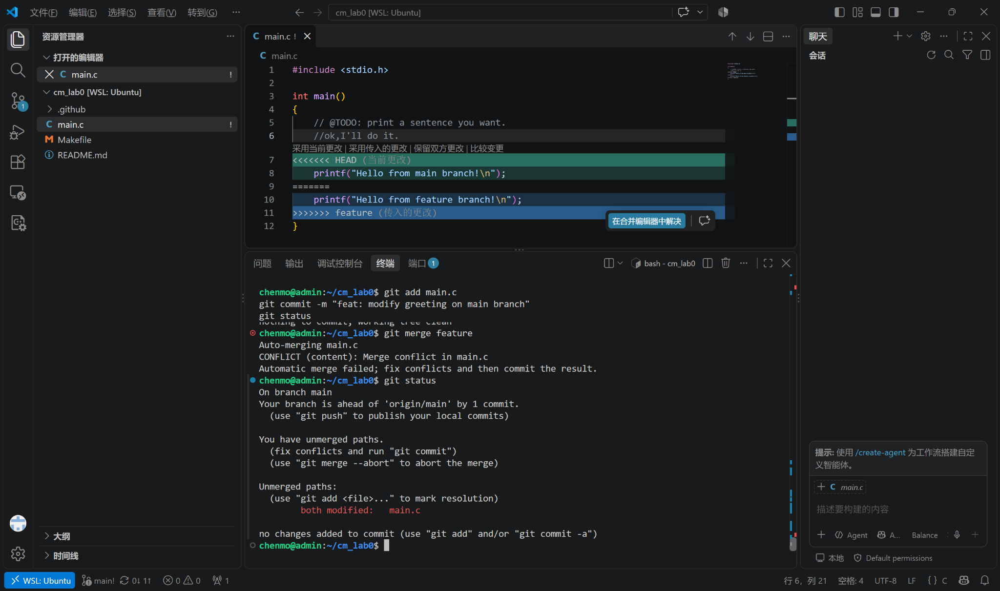
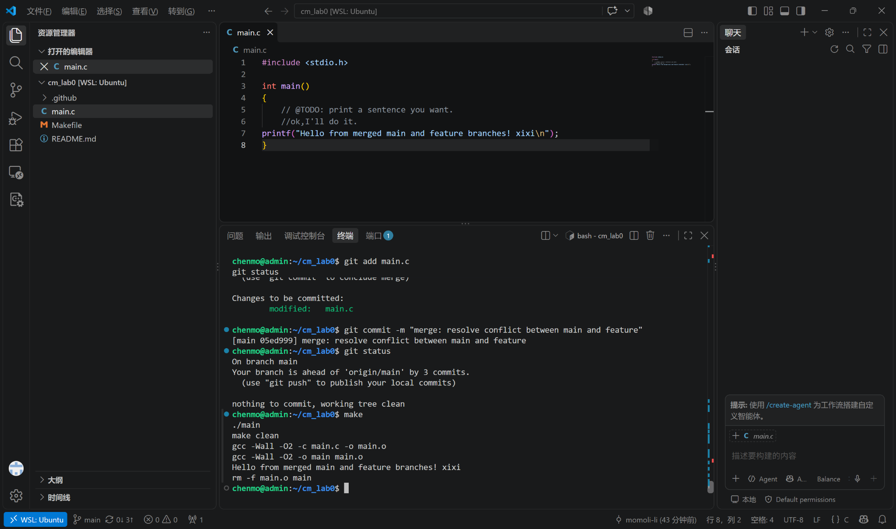
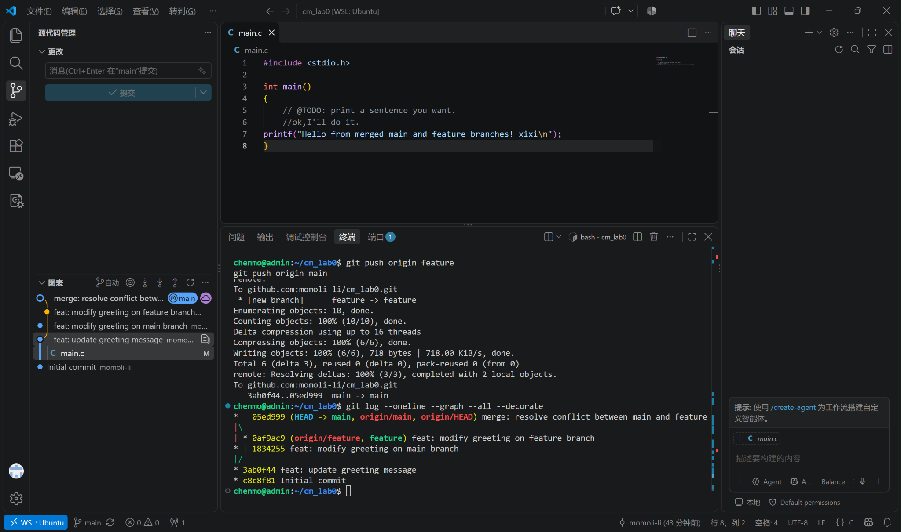

# Lab0: GitLab 实验报告

课程：计算机系统基础（Principles of Computer Systems）  
实验：Lab0 — GitLab  
个人仓库：https://github.com/momoli-li/cm_lab0

## 1. Git 基础问题

### 1.1 你之前有过多人协同开发的经历吗？如果有，你们是使用什么方式分工协作的？

有过多人协同开发的经历。一般会先按照功能模块划分任务，各成员分别负责自己的模块，并使用 Git 进行版本管理。开发时通常在独立分支上完成修改，通过 commit 记录每次变更，在合并到主分支前检查代码差异；如果多人修改了同一处代码，则通过 merge 并手动处理冲突。这样的方式能够减少互相覆盖代码的问题，也便于追踪每次修改的来源。

### 1.2 Git 为什么要设计“暂存（stage）—提交（commit）”两个步骤？

工作区中的修改不一定都属于同一个逻辑改动，因此 Git 在工作区和版本库之间增加了暂存区。`git add` 可以先选择本次真正准备提交的文件或修改，而 `git commit` 再把暂存区中的内容保存为一个版本。

这种设计可以把一次较大的修改拆成多个语义清晰的提交，避免把临时文件或无关修改一起提交，同时也方便在 commit 前再次检查本次提交的内容。因此，“暂存—提交”使版本历史更加清晰、可控。

### 1.3 `git branch` 和 `git branch -a` 的区别是什么？

`git branch` 默认只显示本地分支，并用 `*` 标记当前所在分支；`git branch -a` 会同时显示本地分支和远程跟踪分支，例如 `remotes/origin/main`、`remotes/origin/feature`。因此，当需要查看本地和远程仓库中已知的全部分支时，可以使用 `git branch -a`。

## 2. 阅读材料总结

本次选择阅读 **Commit Message 规范** 和 **语义化版本（Semantic Versioning）**。

### 2.1 Commit Message 规范

规范化的 Commit Message 可以让提交历史更容易阅读、检索，也便于自动生成 Change Log。常见格式为：

```text
<type>(<scope>): <subject>
```

其中 `type` 表示提交类型，例如 `feat` 表示新增功能，`fix` 表示修复问题，`docs` 表示文档修改，`refactor` 表示重构等；`scope` 用于说明影响范围，可省略；`subject` 简要说明本次提交的目的。正文和 Footer 可以进一步描述修改原因、Breaking Change 或关联 Issue。

在本次实验中，我也采用了较清晰的提交信息，例如：

```text
feat: update greeting message
feat: modify greeting on feature branch
feat: modify greeting on main branch
merge: resolve conflict between main and feature
```

### 2.2 语义化版本

语义化版本使用 `MAJOR.MINOR.PATCH` 的形式表示版本号。例如 `2.3.1` 中，`2` 为主版本号，`3` 为次版本号，`1` 为修订号。

- 当产生不兼容的 API 修改时，增加主版本号（MAJOR）；
- 当以向后兼容方式增加功能时，增加次版本号（MINOR）；
- 当进行向后兼容的问题修复时，增加修订号（PATCH）。

这种规则使版本号不仅是编号，也能够表达软件变更的性质，帮助开发者判断升级可能带来的影响。

### 2.3 为什么要学习 Git

Git 不只是代码备份工具，更重要的是帮助开发者管理“代码如何一步步变化”。通过 commit 可以保留清晰的修改历史，通过 branch 可以让不同功能并行开发，通过 merge 可以把不同开发线重新整合，而出现问题时还可以追踪、比较甚至回退版本。

对于多人协作项目，Git 还提供了一套相对统一的协作方式，使不同成员能够在不直接覆盖彼此工作的情况下并行开发。因此，无论是个人项目还是团队项目，Git 都是非常基础且重要的开发工具。

## 3. 实验步骤

### 3.1 使用模板仓库创建个人仓库并克隆

按照实验要求，通过课程模板仓库创建个人仓库，而不是使用 Fork。随后通过 SSH 将仓库克隆到本地：

```bash
git clone git@github.com:momoli-li/cm_lab0.git
cd cm_lab0
```

使用 `git status` 检查仓库状态，初始位于 `main` 分支且工作区干净。

### 3.2 修改 `main.c` 并完成第一次提交

将原始输出：

```c
printf("Hello, world!\n");
```

修改为：

```c
printf("Hello, ICS! And, CM is handsome.\n");
```

使用 `make` 编译并运行验证后，执行：

```bash
git add main.c
git commit -m "feat: update greeting message"
git push origin main
```

第一次提交的 commit 为 `3ab0f44`。



### 3.3 创建 `feature` 分支并分别修改

创建并切换到 `feature` 分支：

```bash
git switch -c feature
```

在 `feature` 分支将同一行修改为：

```c
printf("Hello from feature branch!\n");
```

并提交：

```bash
git add main.c
git commit -m "feat: modify greeting on feature branch"
```

对应 commit 为 `0af9ac9`。

随后切换回 `main`：

```bash
git switch main
```

在 `main` 分支把同一行修改为：

```c
printf("Hello from main branch!\n");
```

并提交：

```bash
git add main.c
git commit -m "feat: modify greeting on main branch"
```

对应 commit 为 `1834255`。

## 4. 合并冲突与解决过程

### 4.1 制造并观察冲突

在 `main` 分支执行：

```bash
git merge feature
```

由于 `main` 和 `feature` 分支都修改了 `main.c` 中同一行代码，Git 无法自动判断应采用哪一份修改，因此出现内容冲突：

```text
CONFLICT (content): Merge conflict in main.c
Automatic merge failed; fix conflicts and then commit the result.
```

此时 `git status` 显示：

```text
both modified: main.c
```

VS Code 中也显示了 `HEAD`（当前 `main` 分支）和 `feature` 两侧的冲突内容。



### 4.2 手动解决冲突

冲突区域原本同时包含：

```c
printf("Hello from main branch!\n");
printf("Hello from feature branch!\n");
```

手动整合后，将最终结果修改为：

```c
printf("Hello from merged main and feature branches! xixi\n");
```

保存文件后执行：

```bash
git add main.c
git status
git commit -m "merge: resolve conflict between main and feature"
```

`git status` 提示冲突已经解决，最终生成 merge commit `05ed999`。随后重新执行：

```bash
make
./main
make clean
```

程序能够正常编译并输出：

```text
Hello from merged main and feature branches! xixi
```



## 5. 分支合并结果

最后将两个分支推送至远程仓库：

```bash
git push origin feature
git push origin main
```

使用以下命令查看提交图：

```bash
git log --oneline --graph --all --decorate
```

最终提交关系为：

```text
*   05ed999 (HEAD -> main, origin/main) merge: resolve conflict between main and feature
|\
| * 0af9ac9 (origin/feature, feature) feat: modify greeting on feature branch
* | 1834255 feat: modify greeting on main branch
|/
* 3ab0f44 feat: update greeting message
* c8c8f81 Initial commit
```

可以看到 `main` 和 `feature` 从同一版本分叉，各自完成提交后，通过 merge commit 再次合并。



## 6. 实验总结

通过本次实验，我实际完成了从仓库克隆、修改、暂存、提交、分支创建，到合并和冲突处理的一整套 Git 基本流程。相比只记忆命令，本次主动在两个分支修改同一行代码并处理冲突，使我更直观地理解了 Git 的分支模型，以及 merge conflict 产生的原因和解决方法。同时，通过规范 Commit Message 和查看提交图，也体会到清晰的版本历史对于后续维护和团队协作的重要性。

## 参考资料

1. ICS 26 Fall Lab0 Git 实验文档：https://ics-26fall-fdu.github.io/labs/lab0-git-lab/
2. 阮一峰，《Commit message 和 Change log 编写指南》：https://www.ruanyifeng.com/blog/2016/01/commit_message_change_log.html
3. Semantic Versioning 2.0.0：https://semver.org/lang/zh-CN/
